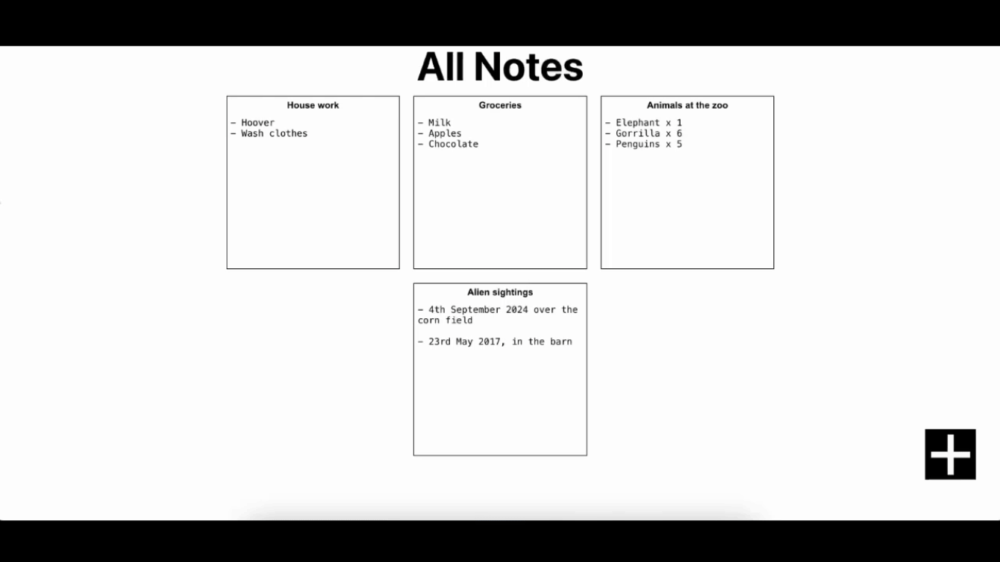

# React-Full-Stack-Project

 

### About

- A browser based notes app
- Allows the user to create, edit and delete notes
- Notes are saved locally using SQLite

### Launch the App
Front End

1) Navigate to the project root folder
2) Run:

       npm start

Back End

1) Navigate to the project root folder
2) Run:

       node server.js
